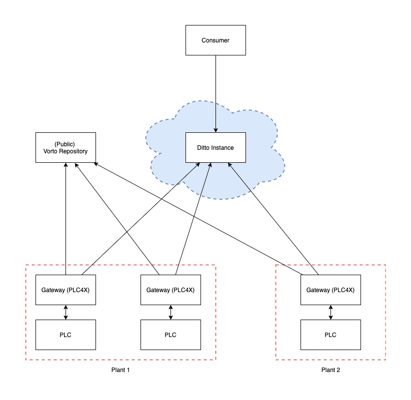

# Building an Industrial IoT Solution - Open Source

In this post we will show how you can build an Industrial IoT Solution with Gateway / Client and Backend fully based on Open Source Technology.
Industrial IoT means that our things are not the well-known Consumer goods as mobiles, watches or wearables but are industrial machinery. In most situtations machines or automation lines are controlled by PLC Controllers. Thus, to talk to machines you have to talk to PLC controllers.
The PLCs have all sensors and actors of the machines attached, thus you get every information about the machine and could, in theory, even change the operation of the machine.
In this example we focus on 

* describing the machine, its data and its capabilities
* reading the data from the PLC controller
* send the data from the secured shopfloor network to a (cloud) backend
* make the data there accessible to other services for e.g. visualization, further analysis, artificial intelligence, ...

We will show how all points above can be realized with the additional benefits of

* flexibility regarding PLC vendors and protocols
* generally available machine descriptions that could even be shared
* security and fine controlled access control for data of different machines or plants

by relying on the Open Source Projects Apache PLC4X, Eclipse Vorto and Eclipse Ditto.

The overall architecture is shown in Figure 1.



 ## General Architecture
 
[Figure 1](#figure_1) shows the general architecture of the setup. On the Edge we have a gateway running which communicates with the PLC to fetch the necessary data.
The Gateway communicates with a (public) Vorto repository to fetch all information and parameters to get the desired data. When data is acquired the Gateway forwards the data to a Ditto instance where it is then available via HTTP or WebSockets. External Services can query the datasets there.  
 
 ## Details
 
 ### The Model - Vorto
 
In our scenario we expect the "Thing" to be some kind of machinery. To get a semantic description of the data we will collect, we need to have a semantic model of the machine, its properties and its features.
[Eclipse Vorto](https://github.com/eclipse/vorto/) provides the framework for exactly that. 
Eclipse Vorto is an open source project for semantic modelling of IoT devices. The project consists of 3 main components:
- a domain specific language - [Vortolang](https://github.com/eclipse/vorto/blob/development/docs/vortolang-1.0.md) - to describe the characteristics and capabilities of device models
- a [repository](https://vorto.eclipse.org/) to edit, manage, version and distribute the Vorto models
- [plugins](https://vorto.eclipse.org/#/generators) to transform Vorto models into different representations (e.g. JSON Schema, etc.), REST request templates (e.g. for Ditto)

For our use case, we describe the machine in an example vorto file using Vortolang:
 
```
vortolang 1.0
namespace org.apache.plc4x.examples
version 1.0.0
displayname "SimulatedPlcTwo"
description "Functionblock for SimulatedPlcTwo"

functionblock SimulatedPlcTwo {

    configuration {
        position as double
        random as double
        motorCurrent as double
        processState as int
        availability as boolean
    }

}
```
[View it in the official Vorto repository](https://vorto.eclipse.org/#/details/org.apache.plc4x.examples:SimulatedPlcTwo:1.0.0).

*TODO Kevin: Model auf "offizielles Modell" umstellen. Date etwas erklären*

As described in our Vorto file, our machine exposes its position as floating-point value and some other properties, which are described in the vortofile.
This description aims towards usage of the data. So someone who later wants to access the data, e.g. for analysis has a semantic description of what the datapoints mean.

For the Gateway, we also want to add information on how to read this information from the machine. It could be, that this differs between different manufactured machines, e.g. due to changes in the machine program. Although the general properties and features of the machine are always the same.
Vorto provides a feature to achieve exactly that: [Function Block Mapping](https://github.com/eclipse/vorto/blob/development/docs/vortolang-1.0.md#function-block-mapping).

The Function Block Mapping allows adding platform- or implementation-specific information to a generic Vorto model. This helps to keep the Vorto models platform-independent and re-usable, as they only contain the semantically relevant information.
It works by enriching properties of the Vorto model with the platform-specific information - the complete model with the enriched properties can be retrieved by adding your target platform as path parameter to the REST request to the standard API: /api/v1/models/{model ID}/content/{target platform}

In our case, the information has to be read from a PLC which is connected to the machine. Thus, for each field we need to add information about the PLC, the address / memory location where the information is stored and a poll time, i.e. how often we want to read the value from the PLC and update the twin.

Our exemplary Function Block Mapping looks as follows:

```
vortolang 1.0
namespace org.apache.plc4x.examples
version 1.0.0
displayname "SimulatedPLC"
description "Mapping for SimulatedPLC"

using org.apache.plc4x.examples.SimulatedPlcTwo;1.0.0

functionblockmapping SimulatedPLC {

	targetplatform simulatedPlc
	
	from SimulatedPlcTwo.configuration.position to position with {
	    url: "s7://",
	    rate: "2000",
	    address: "%DB"
	}

}
```
[View it in the official Vorto repository](https://vorto.eclipse.org/#/details/org.apache.plc4x.examples:SimulatedPLC:1.0.0)

Here we introduce three (arbitrary) keys, which we call `url`, `rate` and `address`.
The respective values represent the url of the PLC, the rate with which we will read the respective value in milliseconds and the address inside the PLC.

Vorto automatically merges both models and exposes them via an HTTP GET Endpoint:

```
https://vorto.eclipse.org/api/v1/models/org.apache.plc4x.examples.SimulatedPlcTwo:1.0.0/content/simulatedplc
```

For the two models shown above, this looks

```
{
    "root": {
        "name": "SimulatedPlcTwo",
        "namespace": "vorto.private.julian.demo.plc4x",
        "version": "1.0.0",
        "prettyFormat": "vorto.private.julian.demo.plc4x:SimulatedPlcTwo:1.0.0"
    },
    "models": {
        "vorto.private.julian.demo.plc4x:SimulatedPLC:1.0.0": {
            "targetPlatformKey": null,
            "stereotypes": [],
            "mappingReference": null,
            "vortolang": "1.0",
            "id": {
                "name": "SimulatedPLC",
                "namespace": "vorto.private.julian.demo.plc4x",
                "version": "1.0.0",
                "prettyFormat": "vorto.private.julian.demo.plc4x:SimulatedPLC:1.0.0"
            },
            "type": "Mapping",
            "displayName": null,
            "description": null,
            "category": null,
            "fileName": "SimulatedPLC.mapping",
            "modelType": "ModelInfo",
            "references": [],
            "author": null,
            "creationDate": null,
            "modificationDate": null,
            "lastModifiedBy": null,
            "hasImage": false,
            "state": null,
            "imported": false,
            "visibility": "private",
            "referencedBy": [],
            "platformMappings": {},
            "released": false,
            "fullQualifiedFileName": "vorto.private.julian.demo.plc4x-SimulatedPLC-1.0.0.mapping"
        },
        "vorto.private.julian.demo.plc4x:SimulatedPlcTwo:1.0.0": {
            "targetPlatformKey": "simulatedplc",
            "stereotypes": [],
            "mappingReference": null,
            "vortolang": "1.0",
            "id": {
                "name": "SimulatedPlcTwo",
                "namespace": "vorto.private.julian.demo.plc4x",
                "version": "1.0.0",
                "prettyFormat": "vorto.private.julian.demo.plc4x:SimulatedPlcTwo:1.0.0"
            },
            "type": "Functionblock",
            "displayName": "SimulatedPlcTwo",
            "description": "Functionblock for SimulatedPlcTwo",
            "category": null,
            "fileName": "SimulatedPlcTwo.fbmodel",
            "modelType": "FunctionblockModel",
            "references": [],
            "configurationProperties": [
                {
                    "targetPlatformKey": "simulatedPlc",
                    "stereotypes": [
                        {
                            "name": "position",
                            "attributes": {
                                "address": "%DB",
                                "rate": "2000",
                                "url": "s7://"
                            }
                        }
                    ],
                    "mappingReference": null,
                    "mandatory": true,
                    "name": "position",
                    "description": null,
                    "type": "DOUBLE",
                    "constraints": [],
                    "attributes": [],
                    "multiple": false,
                    "primitive": true
                },
                {
                    "targetPlatformKey": "simulatedPlc",
                    "stereotypes": [],
                    "mappingReference": null,
                    "mandatory": true,
                    "name": "random",
                    "description": null,
                    "type": "DOUBLE",
                    "constraints": [],
                    "attributes": [],
                    "multiple": false,
                    "primitive": true
                },
                {
                    "targetPlatformKey": "simulatedPlc",
                    "stereotypes": [],
                    "mappingReference": null,
                    "mandatory": true,
                    "name": "motorCurrent",
                    "description": null,
                    "type": "DOUBLE",
                    "constraints": [],
                    "attributes": [],
                    "multiple": false,
                    "primitive": true
                },
                {
                    "targetPlatformKey": "simulatedPlc",
                    "stereotypes": [],
                    "mappingReference": null,
                    "mandatory": true,
                    "name": "processState",
                    "description": null,
                    "type": "INT",
                    "constraints": [],
                    "attributes": [],
                    "multiple": false,
                    "primitive": true
                },
                {
                    "targetPlatformKey": "simulatedPlc",
                    "stereotypes": [],
                    "mappingReference": null,
                    "mandatory": true,
                    "name": "availability",
                    "description": null,
                    "type": "BOOLEAN",
                    "constraints": [],
                    "attributes": [],
                    "multiple": false,
                    "primitive": true
                }
            ],
            "statusProperties": [],
            "faultProperties": [],
            "events": [],
            "operations": [],
            "superType": null,
            "fullQualifiedFileName": "vorto.private.julian.demo.plc4x-SimulatedPlcTwo-1.0.0.fbmodel"
        }
    }
}
```

The most important section for the gateway here is the `configurationProperties`, which is an array with all properties and the additional mapping attributes. For the `position` this is 

```
{
    "targetPlatformKey": "simulatedPlc",
    "stereotypes": [
        {
            "name": "position",
            "attributes": {
                "address": "%DB",
                "rate": "2000",
                "url": "s7://"
            }
        }
    ],
    "mappingReference": null,
    "mandatory": true,
    "name": "position",
    "description": null,
    "type": "DOUBLE",
    "constraints": [],
    "attributes": [],
    "multiple": false,
    "primitive": true
}
```

In the next section we will show, how we can write an according gateway, which is able to read data from a wide range of PLCs fully automated with only the data given above in the two Vorto models.
This is achieved by using the Open Source Project [Apache PLC4X](https://plc4x.apache.org).
 
### The Gateway - PLC4X
 
[Apache PLC4X](https://plc4x.apache.org) is a project which aims at providing drivers for all PLC types and other industrial buses with one single programming interface.
Its mission statement is
 
> PLC4X is a set of libraries for communicating with industrial programmable logic controllers (PLCs) using a variety of protocols but with a shared API.

For our demonstrator this has to very important implications if we use PLC4X as communication library. First, we are not tied to a single PLC Vendor with our gateway implementation and second, we dont't have to change a single line of code when switching between different PLC types.
We just use the same API and PLC4X automatically loads the suitable drivers (if they are provided in the path).

// TODO more information here?

Our gateway has 3 main tasks:

* Initially read configuration from Vorto
* Then, in a loop
    * read data from the machines PLC via PLC4X
    * send data to Eclipse Ditto to update the digital twins state
    
The implementation we show here is very simple and straightforward. For productive use one would take other aspects into consideration as more logging, restart capabilities, handling of input errors and so on.
The only input we need for the gateway is the vorto repository and the Function Block Mapping and the Eclipse Ditto connection information as well as a thing id (????).

// TOOD Kevin, do we need the thing id or is this done automagically?

```
static class PlcFetchInformation {
    private final String url;
    private final String address;
    private final int rateMs;
}
```

```
// Fetch Data from Vorto

// Prepare Executor
ScheduledExecutorService executor = Executors.newScheduledThreadPool(4);

for (PlcFetchInformation field : fields) {
    executor.
}
// Start Loop
for (PlcConnection connection = new PlcDriverManager().connect(url)) {
    connection.readRequestBuilder()
        .addItem()
        .build();
    Thread.sleep(1_000);
}
```

### The Backend - Ditto
